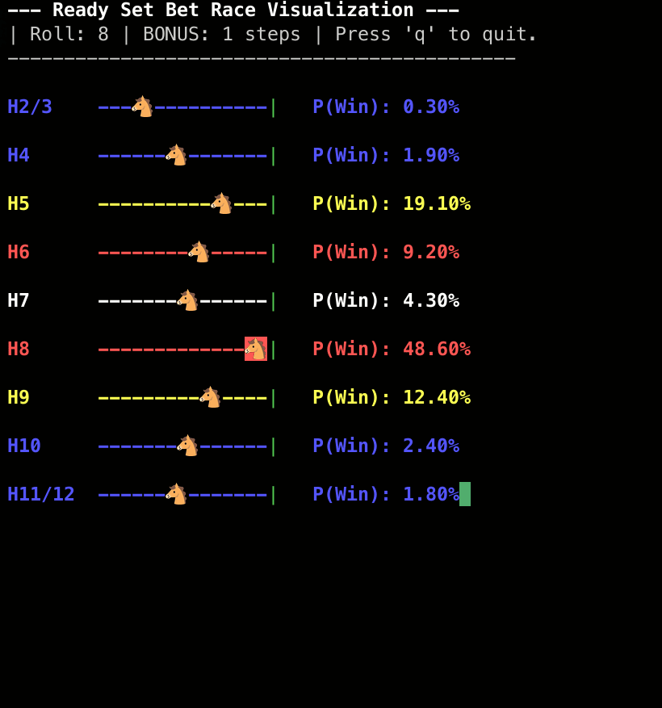

# 🐎 Ready Set Bet: Monte Carlo TUI Simulator

A high-performance, terminal-based horse racing simulator inspired by the board game _Ready Set Bet_. This application combines a **Monte Carlo simulation engine** with a real-time **Text User Interface (TUI)** to predict and visualize race outcomes dynamically.



## 🚀 Key Features

- **Real-time Probability Engine:** Uses Monte Carlo simulations (20,000+ iterations) to calculate winning odds based on asymmetric track lengths and dice roll distributions.
- **Dynamic TUI:** Built with Python's `curses` library, featuring a live-updating leaderboard and animated race track.
- **Predictive Analytics:** Provides live Win Probabilities ($P_{win}$) that update as the race state changes.
- **Robust Boundary Handling:** Custom logic to handle terminal resizing and coordinate overflow gracefully, preventing common `curses` crashes.
- **Deterministic Environment:** Powered by `uv` for lightning-fast, reproducible builds.

## 🛠️ Tech Stack

- **Language:** Python 3.12+
- **Package Manager:** [uv](https://github.com/astral-sh/uv)
- **Interface:** `curses` (built-in on Unix, `windows-curses` for compatibility)
- **Modeling:** `dataclasses` for state management and `Counter` for statistical tracking.

## 📦 Installation & Setup

This project uses `uv` for dependency management. If you don't have it installed:

```bash
curl -LsSf [https://astral-sh.uv/install.sh](https://astral-sh.uv/install.sh) | sh
```

### 1. Clone the repository

```bash
git clone [https://github.com/your-username/ready-set-bet-tui.git](https://github.com/your-username/ready-set-bet-tui.git)
cd ready-set-bet-tui
```

### 2. Sync dependencies

```bash
uv sync
```

## 🎮 How to Run

```bash
uv run rsb
```

- **Controls:** Press `q` to quit.
- **Tip:** Maximize your terminal window or use a modern terminal (like Windows Terminal or iTerm2) for the best visual experience.

## 🧪 Technical Deep Dive

### Monte Carlo vs. Analytical Solution

The core logic evaluates the race state through massive simulation.

- **The Complexity:** An analytical solution using Markov Chains for this game is computationally intractable due to a state space of $\approx 10^{10}$ and complex "bonus move" rules.
- **The Solution:** This project uses a frequentist simulation approach to provide accurate "Win Probabilities" in real-time, balancing accuracy with computational efficiency.

### TUI Architecture

The drawing engine is designed for stability:

- **Coordinate Capping:** Uses `stdscr.getmaxyx()` to ensure `addstr()` never exceeds terminal boundaries.
- **Error Isolation:** Each horse's drawing logic is wrapped in `try...except curses.error` to prevent app crashes during terminal resizing or edge-case overflows.

## 📂 Project Structure

```plaintext
.
├── docs/                # Documentation assets (GIFs, images)
├── src/
│   └── readysetbet/     # Core package logic
│       ├── main.py      # Entry point
│       ├── simulation.py # Monte Carlo engine
│       └── tui.py        # Curses rendering logic
├── pyproject.toml       # Project metadata and CLI entry points
└── uv.lock              # Deterministic lockfile
```

## 📄 License

MIT
